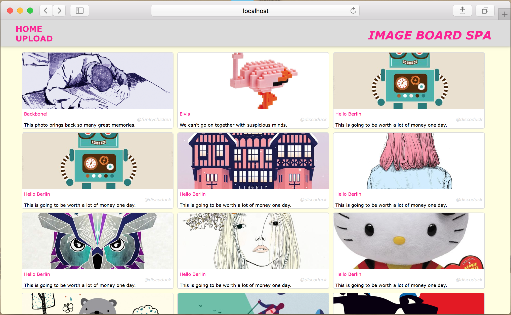

# Imageboard

## Overview
Single-page Application with Backbone.js

## Technologies
- Backbone.js
- Node.js
- Express.js
- PostgreSQL
- AWS S3 for storing images

## Details

### Image Board to view all images uploaded by any user

### Image Upload page

### Known Bugs
- submit without input possible (required fields)
- after upload: render home view
- delete image from diskStorage
- missing comments display
